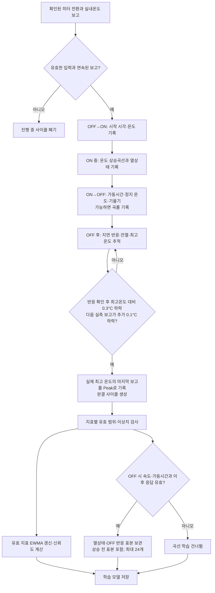
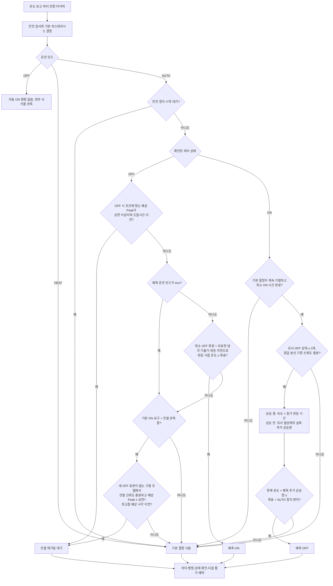

# 난방 학습 및 AUTO ON/OFF 제어 흐름

현재 구현의 완결 사이클 학습과 AUTO 판단 순서를 나타냅니다. 센서·히터 상태는 Home Assistant에 보고된 값을 기준으로 합니다.
아래 도식은 기본으로 선택되는 기존 학습 모델을 설명합니다. 별도 `AUTO 학습 모델` 셀렉터로 선택하는 5분 커브 학습의 경계와 저장 규칙은 [커브 학습 문서](curve_learning.md)에 정리했습니다.

## 난방 학습 흐름

OFF·HEAT·AUTO 모두 확인된 히터 전환과 실제 실내온도 보고를 관측합니다. 아래 사이클은 히터를 끈 시점이 아니라 OFF 후 최고온도를 지나 하강이 확인될 때 완결됩니다.

센서 오류·보고 공백·재시작 또는 제어 중 예상하지 못한 스위치 전환으로 끊긴 사이클은 완결 표본으로 학습하지 않습니다. 난방 반응 지연·가열률·잔열 상승·최고점 지연은 각각 검증하며, 평균 가열률은 진단값으로 유지합니다. 현재 모델은 에어컨 운전 상태를 입력받지 않아 보일러 단독 운전과 에어컨 병행 운전의 곡선을 분리하지 않습니다.

## AUTO ON/OFF 적용 흐름

기본 제어기가 현재 온도, 오류, 시작 시 OFF 확인, 히스테리시스와 최소 ON/OFF 시간을 먼저 평가합니다. AUTO는 허용된 기본 결정에 학습값을 적용합니다.

별도 정책 셀렉터의 기본값은 balanced입니다. eco는 예측 ON만 건너뛰고, 기본 모델에서 balanced는 학습 반응 지연에 신뢰도와 0.5를, comfort는 신뢰도만 곱합니다. 예측 OFF는 상승 중에는 등가 OFF 반응 시간을, 상승 전에는 유사 열상태의 실제 추가 상승량을 사용합니다. 신뢰도는 예측 사용 여부를 결정하며 예상 상승량 자체를 줄이지 않습니다. 정지 후 재가동 대기는 실제 OFF 기준 예상 Peak와 도달시간을 예측 ON보다 먼저 사용합니다. OFF 온도보다 0.5°C 넘게 내려가면 다시 평가하며, 구형 집계값 대기는 새 OFF 표본이 없는 모델에 한정합니다. AUTO의 기본 정지 경계는 목표온도 + 0.5°C이며 옵션에서 조정할 수 있습니다. 커브 모델의 OFF 궤적 결합과 Cooling 기반 ON은 [모델별 작동 로직](model_operation.md)을 참조하세요.
