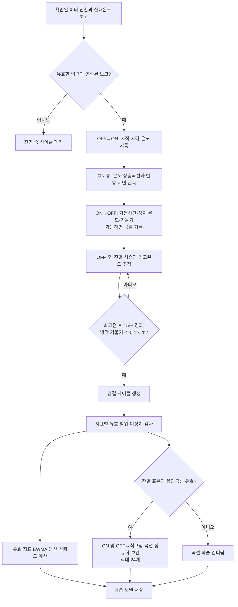
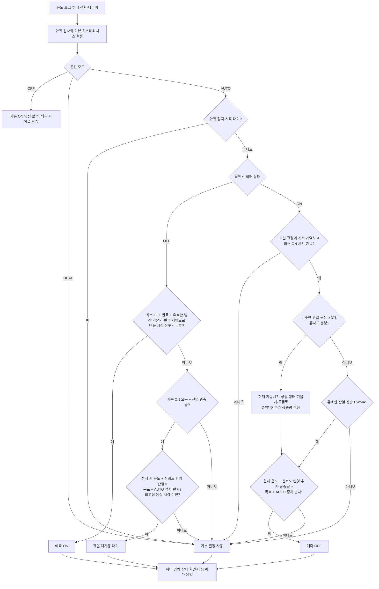

# 난방 학습 및 AUTO ON/OFF 제어 흐름

현재 구현의 완결 사이클 학습과 AUTO 판단 순서를 나타냅니다. 센서·히터 상태는 Home Assistant에 보고된 값을 기준으로 합니다.

## 난방 학습 흐름

OFF·HEAT·AUTO 모두 확인된 히터 전환과 실제 실내온도 보고를 관측합니다. 아래 사이클은 히터를 끈 시점이 아니라 OFF 후 최고온도를 지나 하강이 확인될 때 완결됩니다.

센서 오류·보고 공백·재시작 또는 제어 중 예상하지 못한 스위치 전환으로 끊긴 사이클은 완결 표본으로 학습하지 않습니다. 난방 반응 지연·가열률·잔열 상승·최고점 지연은 각각 검증하며, 평균 가열률은 진단값으로 유지합니다. 현재 모델은 에어컨 운전 상태를 입력받지 않아 보일러 단독 운전과 에어컨 병행 운전의 곡선을 분리하지 않습니다.

## AUTO ON/OFF 적용 흐름

기본 제어기가 현재 온도, 오류, 시작 시 OFF 확인, 히스테리시스와 최소 ON/OFF 시간을 먼저 평가합니다. AUTO는 허용된 기본 결정에 학습값을 적용합니다.

학습값이 없으면 AUTO도 기본 히스테리시스 결정을 사용합니다. 예측 ON은 최근 냉각 기울기와 학습된 반응 지연을 사용하고, 예측 OFF는 곡선이 충분하면 곡선 기반 잔열 추정을 우선합니다. 잔열 재가동 대기는 완결 곡선이 아닌 기존 잔열·최고점 지연 집계값을 사용합니다. AUTO의 기본 정지 경계는 목표온도 + 0.5°C이며 옵션에서 조정할 수 있습니다.
